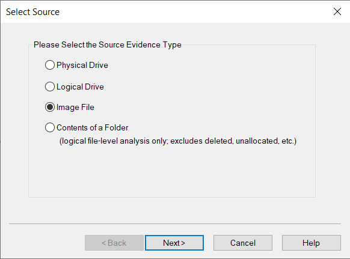

# Insider


Always open malware in a secure environment like a VM.



We will be using the [REMnux](https://remnux.org/) distribution which is specifically made for reverse engineering.


##

* Before we begin, we need to add the evidence item to [FTK Imager](https://www.exterro.com/ftk-imager) as an image.

<figure><figcaption></figcaption></figure>

##

> Q1. What distribution of Linux is being used on this machine?

* We can find distribution in the `boot` directory.

<figure><figcaption></figcaption></figure>

##

> Q2. What is the MD5 hash of the apache access.log?

* The `access.log` for the apache is located in the `var/log/` directory.
* In the bottom left corner, the MD5 hash can be seen.

<figure><figcaption></figcaption></figure>

##

> Q3. It is believed that a credential dumping tool was downloaded? What is the file name of the download?

* We can go to the `Downloads` folder in order to check what file has been downloaded.

<figure><figcaption></figcaption></figure>

##

> Q4. There was a super-secret file created. What is the absolute path?

* There is a `bash_history` file in the `root` directory. It has all the commands that have been entered.

<figure><figcaption></figcaption></figure>

##

> Q5. What program used didyouthinkwedmakeiteasy.jpg during execution?

* This is also included in the `bash_history` file.

<figure><figcaption></figcaption></figure>

##

> Q6. What is the third goal from the checklist Karen created?

* In the Desktop there is a `Checklist` file which has the answer we want.

<figure><figcaption></figcaption></figure>

##

> Q7. How many times was apache run?

* Let's look back at the `access.log` file for apache.

<figure><figcaption></figcaption></figure>

* We can see that the file is empty, which means that apache wasn't run at all.

##

> Q8. It is believed this machine was used to attack another. What file proves this?

* In the `root` directory there is a screenshot named `irZLAohL.jpeg` that shows the user running `aylmao.exe`. This executable generates malicious network traffic.

<figure><figcaption></figcaption></figure>

##

> Q9. Within the Documents file path, it is believed that Karen was taunting a fellow computer expert through a bash script. Who was Karen taunting?

* Fortunately Karen has documented her attack in the `myfirsthack` folder. Inside the `firstscript_fixed` file, we can see who she was taunting.

<figure><figcaption></figcaption></figure>

##

> Q10. A user su'd to root at 11:26 multiple times. Who was it?

* We can go through the `auth.log` file in order to find the user.

<figure><figcaption></figcaption></figure>

##

> Q11. Based on the bash history, what is the current working directory?

* If we go through the `bash_history` in a down-up manner, we can see the current working directory.

<figure><figcaption></figcaption></figure>
