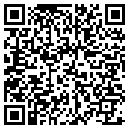

# 1994

> Inspect the boarding pass and see what you find

* The attachment is a QR code which we can download.

<figure><figcaption></figcaption></figure>

* We can then parse through the code using Cyberchef.

<figure><figcaption></figcaption></figure>

### Flag

```
FLAG{ALLONBOARD}
```
