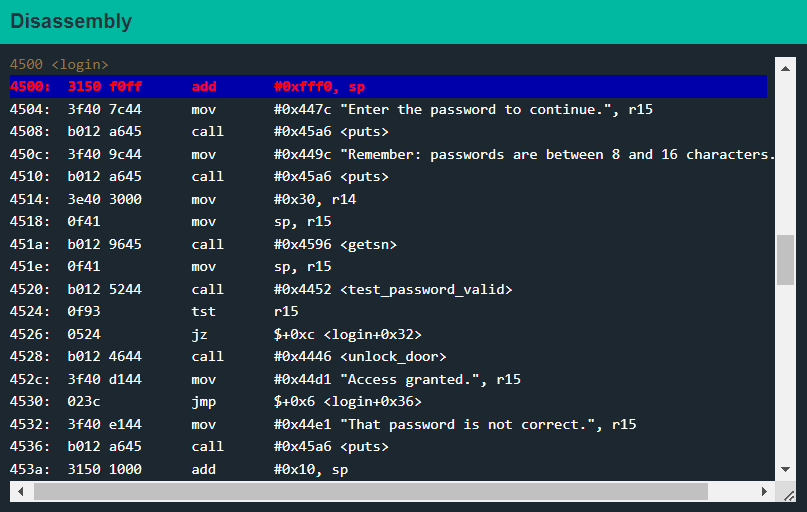
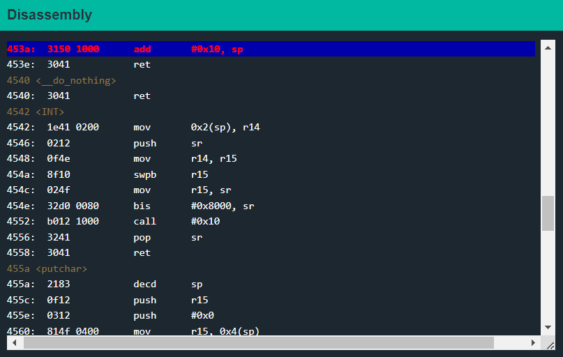
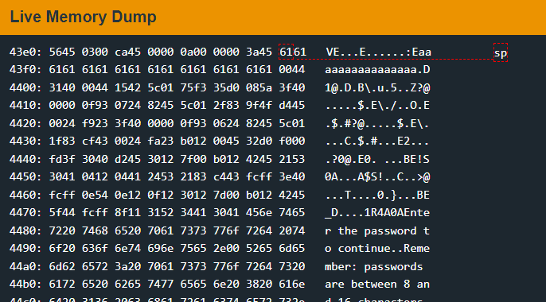
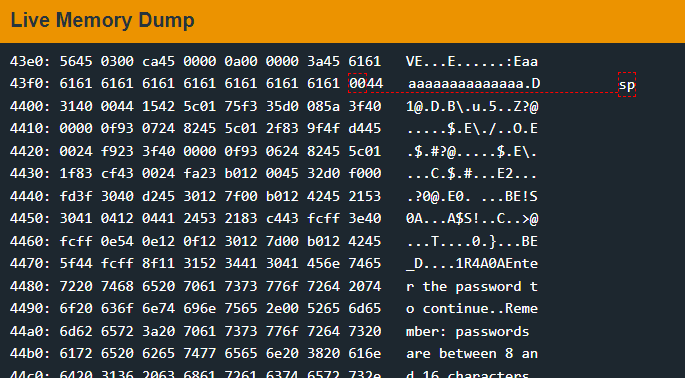
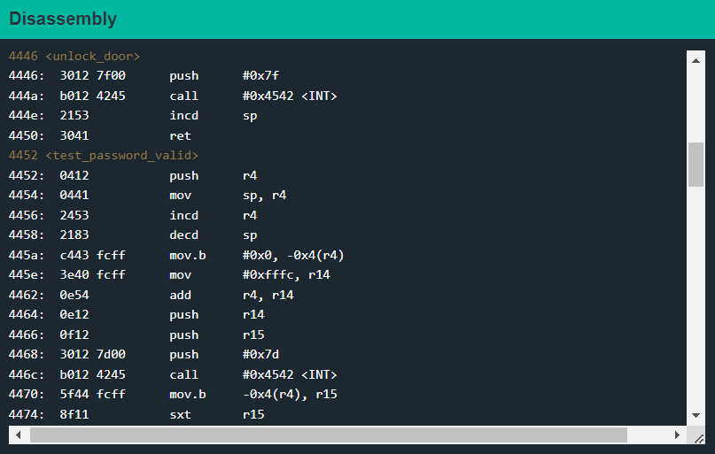
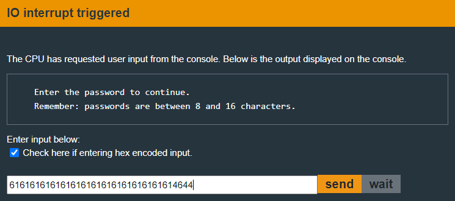
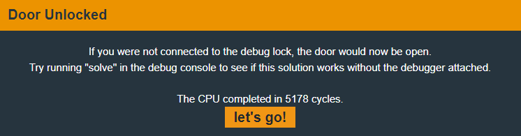

# Cusco

<figure><figcaption></figcaption></figure>

This time, the `main` function only calls the login function.

Let's set a breakpoint at the `login` function.

<figure><figcaption></figcaption></figure>

Once inside the `login` function, we can see that it asks the user to input the password and then jumps based on whether the password is correct.

Let's set a breakpoint right before the function returns.&#x20;

<figure><figcaption></figcaption></figure>

While examining our input in memory, we can see something interesting.&#x20;

<figure><figcaption></figcaption></figure>

As we can see the stack pointer `sp` now points to the beginning of our input.

Let's step once to the `ret` instruction using the `s` command.&#x20;

<figure><figcaption></figcaption></figure>

The stack pointer now points at the location 16 bytes after the start of the buffer because the `add 0x10, sp` instruction just got executed.

When the the `ret` instruction executes, the the bytes pointed to by the `sp` is treated as the return address.

This looks like the start of another buffer overflow attack. What if we overwrite that address with something that we want to execute.&#x20;

<figure><figcaption></figcaption></figure>

Look! there's an `unlock_door` function at `0x4446`. This is something we would really like to execute.

Let's `reset` the program and this time provide an input of 18 bytes. (The program says we can only enter 8 - 16 bytes but it never checks.)&#x20;

<figure><figcaption></figcaption></figure>

Note that the last two bytes are reversed, this is because LSB is stored leftmost and MSB is stored rightmost. This is also known as little-endian format.

The program will interpret these bytes as `4446`.

Let's hit `c` to continue the program.&#x20;

<figure><figcaption></figcaption></figure>

Looks like LockIT hasn't improved their security all that much.
