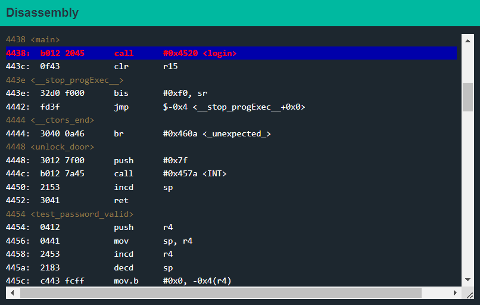
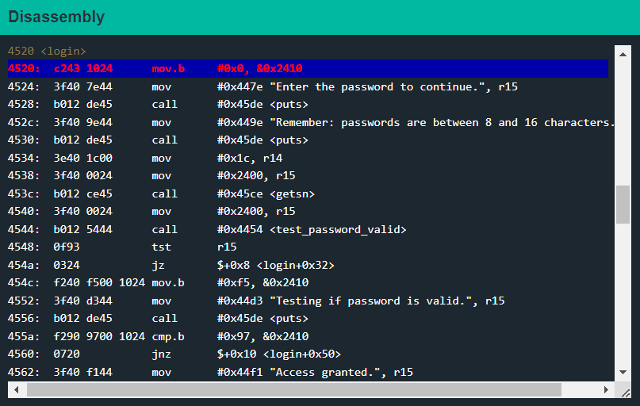
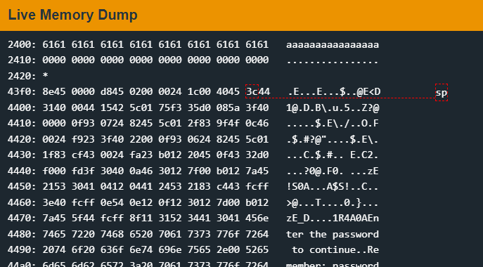
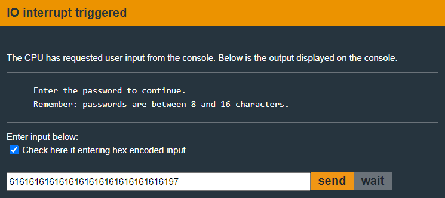
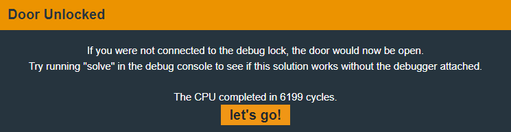

# Hanoi

Let's set a breakpoint as is standard practice.&#x20;

<figure><figcaption></figcaption></figure>

This time it only calls one function:

* `login`

Let's investigate how this function exactly works. Set a breakpoint using `break 4520`.&#x20;

<figure><figcaption></figcaption></figure>

We can see the `getsn` call is what takes the user input. And in the next instruction at `4540`, the user input is stored at memory address `0x2400`.&#x20;

<figure><figcaption></figcaption></figure>

The instruction at `455a` compares the byte at memory address `0x2410` with `0x97`.

If we look at that address, we can see that it is filled with zeroes. We can also do this using the `R 0x2410` command.

```
> R 2410 
2410 0000 0000 0000 0000 0000 0000 0000 0000  ................ 
2420 0000 0000 0000 0000 0000 0000 0000 0000  ................
```

Since our input is stored at `0x2400`, we can overwrite the byte at `0x2410` with 17 bytes minimum. As we are only supposed to enter up to 16 bytes, we are essentially performing a [buffer overflow](https://en.wikipedia.org/wiki/Buffer\_overflow).

Let's try that out. This time we will enter user input in hexadecimal.&#x20;

<figure><figcaption></figcaption></figure>

If we `continue` through the program execution, we are greeted with the following message.&#x20;

<figure><figcaption></figcaption></figure>

We just exploited our first LockIT lock with a buffer overflow.
