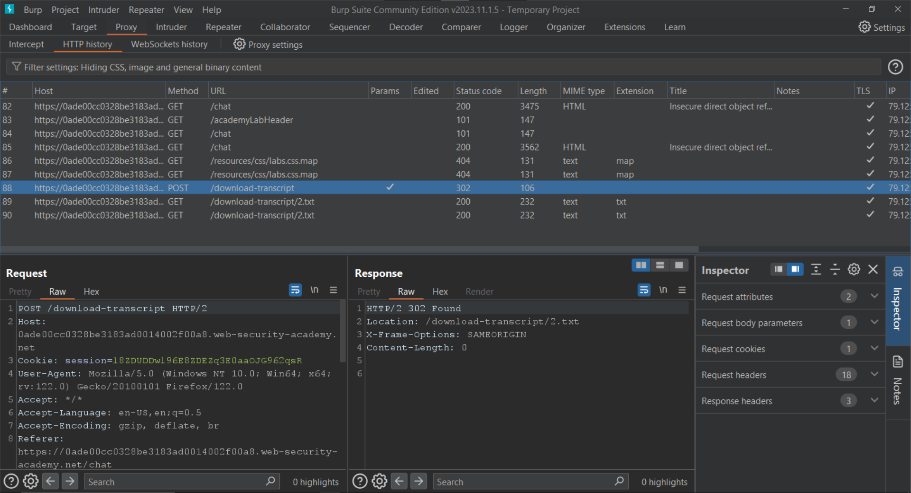

# Insecure direct object references

<figure><figcaption></figcaption></figure>

Let's start the live chat.

<figure><figcaption></figcaption></figure>

We can now download this chat by clicking on the `View transcript` button. Since we are proxying the traffic through Burp Suite, we will be able to see the request in the `Proxy > HTTP History`.

<figure><figcaption></figcaption></figure>

We are being redirected, let's view the next request.

<figure><figcaption></figcaption></figure>

As we can see, our entire chat log is saved. Let's forward this request to the `Repeater` for further modification. Once in the `Repeater`, change the GET URI to the following:

```
/download-tanscript/2.txt
```

<figure><figcaption></figcaption></figure>

This causes the application to give the transcripts of another user's chat. We can now try to login to the `carlos` user's account using the following credentials:

| Username | Password             |
| -------- | -------------------- |
| carlos   | z7yiqtqjuttawu19dlxw |

<figure><figcaption></figcaption></figure>

We have solved the lab.

<figure><figcaption></figcaption></figure>
