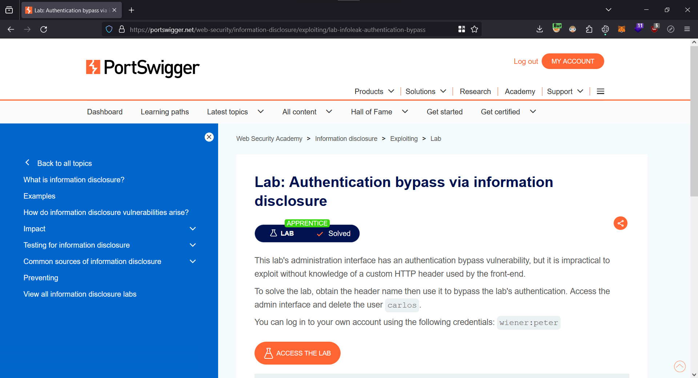

# Authentication bypass via information disclosure

<figure><figcaption></figcaption></figure>

Let's login using the following credentials:

| Username | Password |
| -------- | -------- |
| wiener   | peter    |

Once we have logged in, we can try to access the `/admin` page.

<figure><figcaption></figcaption></figure>

As we can see the admin panel is only accessible to local users. Since we are proxying the request through Burp Suite, we will be able to see the request in the `Proxy > HTTP History` tab.

<figure><figcaption></figcaption></figure>

Let's forward this request to the `Repeater` for further modification. Once in the `Repeater`, let's modify the method to TRACE and send the request.

<figure><figcaption></figcaption></figure>

In the response, the returns contains the `X-Custom-IP-Authorization` header which is set to our IP address. Let's go into the `Proxy settings` tab.

<figure><figcaption></figcaption></figure>

Next we have to scroll down to `Match and Replace` and click `Add`. Inside the `Replace` field, paste the following:

```
X-Custom-IP-Authorization: 127.0.0.1
```

<figure><figcaption></figcaption></figure>

This header will now be added to every request that we send. Therefore, we will be treated as local users and will have access to the admin panel.

<figure><figcaption></figcaption></figure>

Let's go inside and delete the `carlos` user.

<figure><figcaption></figcaption></figure>

We have solved the lab.

<figure><figcaption></figcaption></figure>
