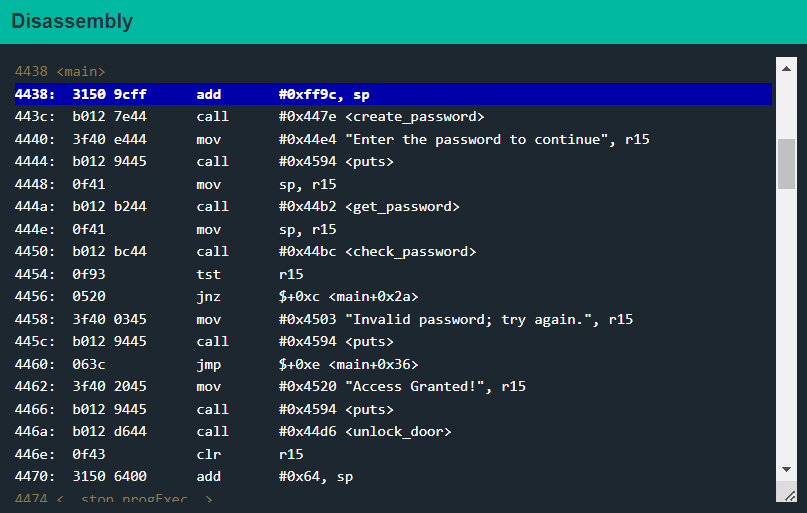
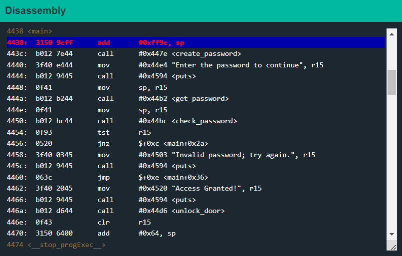
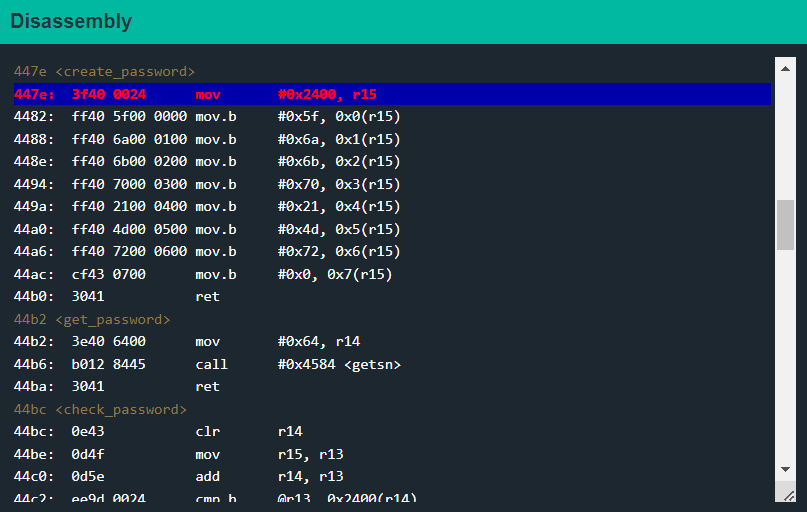
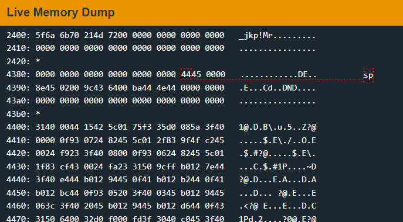
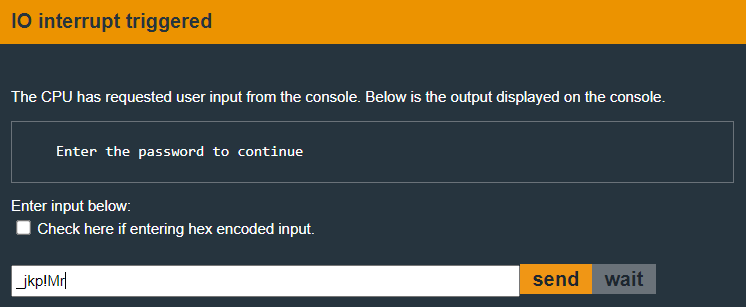
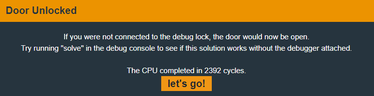

# New Orleans

We can set a breakpoint at main using the `break main` command.&#x20;

<figure><figcaption></figcaption></figure>

We can see that the breakpoint has been set.

If we continue through the program using the `continue` or `c` command, the program has stopped execution at the breakpoint.&#x20;

<figure><figcaption></figcaption></figure>

The program calls the following functions:

* `create_password`: Creates and sets a password for the lock.
* `get_password`: Takes user input.
* `check_password`: Checks if user input is correct.
* The `create_password` function seems interesting. Let's set a breakpoint there using `break 447e` and continue execution flow using `c`.&#x20;

<figure><figcaption></figcaption></figure>

As we can see we are now inside the `create_password` function. Note that we could have directly jumped into this program using `let pc = 447e` command.

So this function sets the value of `r15` to be equal to the address `0x2400` in memory.

And then it moves some characters which seem to be our password into that memory address.

Let's set a breakpoint at `44ac` and `continue` the execution.

Once we hit the breakpoint we can check the memory location using the `R 2400` command

```
> R 2400
2400 5f6a 6b70 214d 7200 0000 0000 0000 0000  _jkp!Mr.........
2410 0000 0000 0000 0000 0000 0000 0000 0000  ................
```

Or we can just look in the Live Memory Dump section.&#x20;

<figure><figcaption></figcaption></figure>

So the string that was read into memory was `_jkp!Mr`.

Let's continue to where we are prompted for the passsword.&#x20;

<figure><figcaption></figcaption></figure>

If we `send` this password to the lock, we get the following message:&#x20;

<figure><figcaption></figcaption></figure>

We have successfully unlocked the door and can get the `Cy Yombinator bearer bonds` or whatever they are called.
