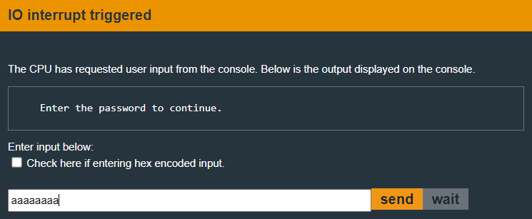
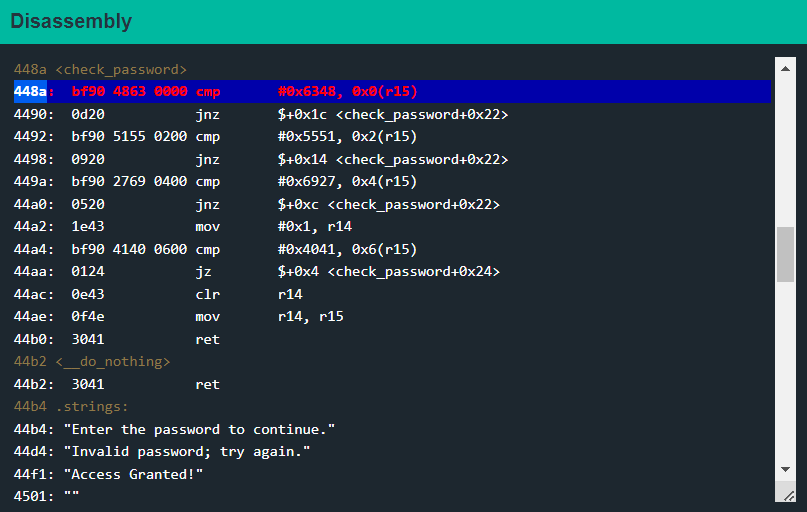
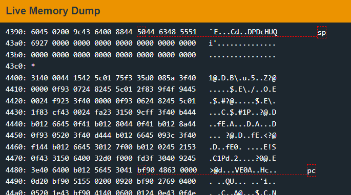
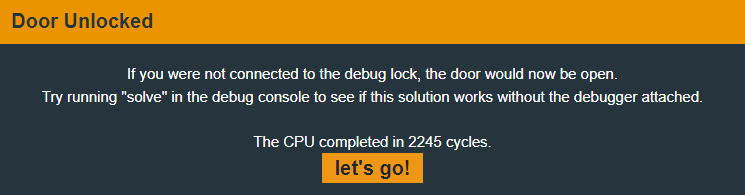

# Sydney

In this revision the password is no longer stored in memory.

Let's set a breakpoint at main using `break main`.&#x20;

<figure><figcaption></figcaption></figure>

We can see that the program no longer calls the `create_password` function. So we'll have to find a new approach to open the lock.

The `check_password` function is still being called, so let's set a breakpoint there.

We are then asked to enter the password.&#x20;

<figure><figcaption></figcaption></figure>

* If we continue the program execution, it stops at the breakpoint that we set earlier at `check_password`.&#x20;

<figure><figcaption></figcaption></figure>

So the first two bytes of our input are being compared with the word `0x6348` which is `cH` in ASCII.

The next two are being compared to `0x5551` which is `UQ` in ASCII. And the next two are being compared with `0x6927` which is `i'` in ASCII and the next two to `@A`.

* Let's rerun the program using the `reset` command and give it the password `cHUQi'@A`.&#x20;

<figure><figcaption></figcaption></figure>

Look, our password is in the memory, we're going to unlock the lock. Or are we?

See, even though the bytes are stored in memory in the correct order, they are not in the order that the program wants them to be.

The program stores bytes in [little-endian](https://www.geeksforgeeks.org/little-and-big-endian-mystery/) format i.e. the LSB is supposed to be in the lowest memory address and MSB in the highest memory address.

So when it reads our first word, it expects them to in little-endian format and reads them as `0x4863`. In the same manner, the next word is read as `0x5155`, the third one is read as `0x2769` and the last word is read as `0x4140`.

In order to pass the checks, our bytes need to be flipped when they are stored so that the program will flip them when reading and interpret them correctly.

Therefore the password should actually be `HcQU'iA@`.&#x20;

<figure><figcaption></figcaption></figure>

We've now robbed the bank in Sydney.
