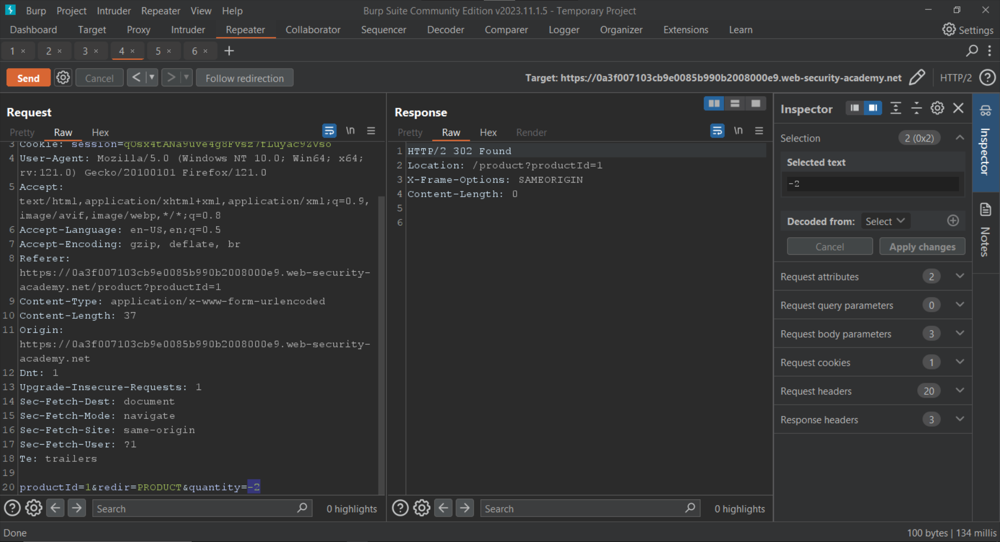
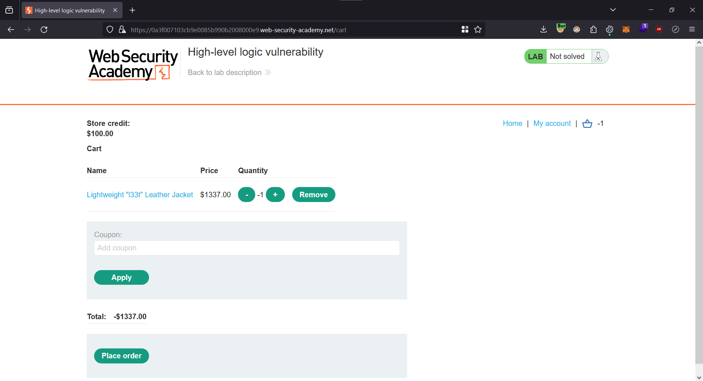

# High-level logic vulnerability

<figure><figcaption></figcaption></figure>

Let's click on the `My account` button and login using the following credentials:

| Username | Password |
| -------- | -------- |
| wiener   | peter    |

<figure><figcaption></figcaption></figure>

Now we can add the "Lightweight l33t leather jacket" to our cart.

<figure><figcaption></figcaption></figure>

Since we are proxying the traffic through Burp Suite, we can go `Proxy > HTTP History` to view the request.

<figure><figcaption></figcaption></figure>

Let's forward this request to the `Repeater` for further modification.&#x20;

Once in the `Repeater`, we can set the `quantity` parameter to the following:

```
-2
```

<figure><figcaption></figcaption></figure>

Let's go back to our cart in the browser.

<figure><figcaption></figcaption></figure>

We can see that the `quantity` has gone from 1 to -1 since we set the `quantity` parameter to -2. Also the price is now negative.

Next, we have to set the `quantity` back to 1 and add another product ("The Trolley-ON") to the cart.

<figure><figcaption></figcaption></figure>

We can view this request in the `Proxy > HTTP History` tab.

<figure><figcaption></figcaption></figure>

Let's forward it to the `Repeater`. Inside the `Repeater` set the `quantity` parameter to the following and send the request:

```
-22
```

<figure><figcaption></figcaption></figure>

Let's check out our cart.

<figure><figcaption></figcaption></figure>

We can see that the quantity of "The Trolley-ON" has gone from 1 to -21. More importantly the price which in in negative has been subtracted from the jacket's price and the total is now lower than our credits.&#x20;

Let's buy the products.

<figure><figcaption></figcaption></figure>

We have solved the lab.

<figure><figcaption></figcaption></figure>
