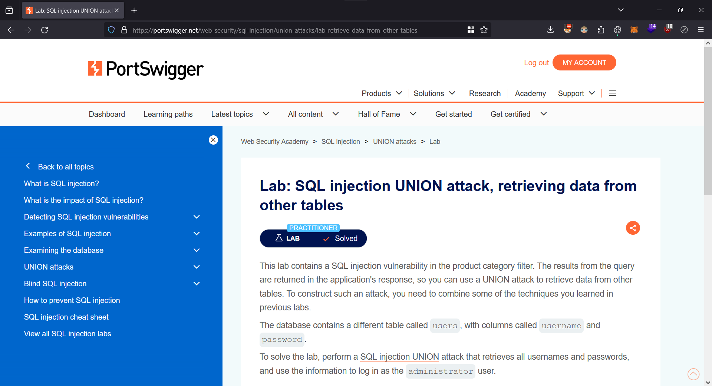

# SQL injection UNION attack, retrieving data from other tables

<figure><figcaption></figcaption></figure>

Let's filter for `Gifts`.

<figure><figcaption></figcaption></figure>

Since we are proxying the traffic through Burp Suite, we can go to the `Proxy > HTTP History` tab to view this request.

<figure><figcaption></figcaption></figure>

Let's forward this request to the `Repeater` for further modification.

Once in the `Repeater`, let's set the `category` parameter to the following:

```
' UNION SELECT 'test'--
```

<figure><figcaption></figcaption></figure>

Since the application returns an error, we know that the number of columns in the current query is more than 1.

Let's set the `category` parameter to the following:

```
' UNION SELECT 'test', 'test'--
```

<figure><figcaption></figcaption></figure>

Now that we know the current query has two columns, we can retrieve the usernames and password from the `username` and `password` columns respectively.

```
' UNION SELECT username, password FROM users--
```

<figure><figcaption></figcaption></figure>

We can now login as the admin using the following credentials:

| Username      | Password             |
| ------------- | -------------------- |
| administrator | 21tpnvx8ho5pyej8z6sy |

<figure><figcaption></figcaption></figure>

We have solved the lab.

<figure><figcaption></figcaption></figure>
