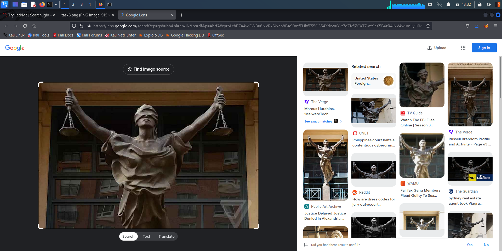

# Searchlight - IMINT



## Task 1: Welcome to the Searchlight IMINT room!

### Did you understand the flag format?

### Answer

```
sl{ready}
```

##

## Task 2 Your first challenge!

### What is the name of the street where this image was taken?

<figure><figcaption></figcaption></figure>

* The image was taken at Carnaby Street, London.

### Answer

```
sl{Carnaby Street}
```

##

## Task 3 Just Google it!

### Which city is the tube station located in?

* On searching for `underground Public Subway` we can see a Wikipedia article that tells us the name of the city.

<figure><figcaption></figcaption></figure>

### Answer

```
sl{London}
```

###

### Which tube station do these stairs lead to?

* The particular tube station is in Piccadily Circus.

<figure><figcaption></figcaption></figure>

### Answer

```
sl{Piccadily Circus}
```

###

### Which year did this station open?

* The answer can be found pretty quickly on Google.&#x20;

<figure><figcaption></figcaption></figure>

### Answer

```
sl{1906}
```

###

### How many platforms are there in this station?

<figure><figcaption></figcaption></figure>

### Answer

```
sl{4}
```

##

## Task 4: Keep at it!

### Which building is this photo taken in?

<figure><figcaption></figcaption></figure>

* We can see the phrase `YVR` on the board.
* Let's see what that stands for.&#x20;

<figure><figcaption></figcaption></figure>

### Answer

```
sl{Vancouver International Airport}
```

###

### Which country is this building located in?

### Answer

```
sl{Canada}
```

###

### Which city is this building located in?

* Even though it is called Vancouver International Airport, it is not located in the city of Vancouver as seen in the image below:&#x20;

<figure><figcaption></figcaption></figure>

### Answer

```
sl{Richmond}
```

##

## Task 5: Coffee and a light lunch

### Which city is this coffee shop located in?

<figure><figcaption></figcaption></figure>

* We know that the shop is located in Scotland and we can see that the shop right opposite to it is called `Edinburgh Woollen Mill`.

<figure><figcaption></figcaption></figure>

### Answer

```
sl{Blairgowrie}
```

###

### Which street is this coffee shop located in?

* Let's open Google Maps and go to 3D view.

<figure><figcaption></figcaption></figure>

* We can see the street name on the top of the coffee shop.

### Answer

```
sl{Allan Street}
```

###

### What is their phone number?

* We can see the phone number listed.&#x20;

<figure><figcaption></figcaption></figure>

### Answer

```
sl{+447878839128}
```

###

### What is their email address?

* In order to find the email address, we have to go tot he Facebook page of the coffee shop.

<figure><figcaption></figcaption></figure>

```
sl{theweecoffeeshop@aol.com}
```

###

### What is the surname of the owners?

* There is an article by Barba.co.uk that lists out the names of the owners.

<figure><figcaption></figcaption></figure>

### Answer

```
sl{Cochrane}
```

##

## Task 6: Reverse your thinking

### Which restaurant was this picture taken at?

* Let's reverse image search using Google Lens.

<figure><figcaption></figcaption></figure>

### Answer

```
sl{Katz's Deli}
```

###

### What is the name of the Bon Appétit editor that worked 24 hours at this restaurant?

* We can find the article that mentions the name of the editor.

<figure><figcaption></figcaption></figure>

### Answer

```
sl{Andrew Knowlton}
```

##

## Task 7: Locate this sculpture

### What is the name of this statue?

* If we search for `motorcycle reindeer sculpture` and click on the first article, we can find the name of the sculpture.

<figure><figcaption></figcaption></figure>

### Answer

```
sl{Rudolph the Chrome Nosed Reindeer}
```

###

### Who took this image?

* On going to the VisitOslo site and searching for `Rudolph the Chrome Nosed Reindeer`, we can see the following article.

<figure><figcaption></figcaption></figure>

* If we go to the article we can find an embedded map that shows all the sculptures in Oslo.

<figure><figcaption></figcaption></figure>

* Let's look for Rudolph.

<figure><figcaption></figcaption></figure>

### Answer

```
sl{Kjersti Stensrud}
```

##

## Task 8: ...and justice for all

### What is the name of the character that the statue depicts?

<figure><figcaption></figcaption></figure>

* The image is depicting Lady Justice.

### Answer

```
sl{Lady Justice}
```

###

### where is this statue located?

* Let's reverse image search using the image.&#x20;

<figure><figcaption></figcaption></figure>

* If we click on the article by the Public Art Archive, we get the following details:

<figure><figcaption></figcaption></figure>

* So the sculpture is located at the Virginia Eastern District Court in Alexandria, Virginia.

### Answer

```
sl{Alexandria, Virginia}
```

###

### What is the name of the building opposite from this statue?

* Let's view the court in Google Map's 3D view.&#x20;

<figure><figcaption></figcaption></figure>

* We can easily see the building opposite by turning the camera around.

<figure><figcaption></figcaption></figure>

### Answer

```
sl{The Westin Alexandria Old Town}
```

##

## Task 9: The view from my hotel room

### What is the name of the hotel that my friend stayed in a few years ago?

* If we take the 13th frame from the video we can see the following:

<figure><figcaption></figcaption></figure>

* A quick reverse image search tells us that the picture is of the Riverside Point in Singapore.
* On Google Maps we can find the name of the hotel from which the photo was take.

### Answer

```
sl{Novotel Singapore Clarke Quay}
```
